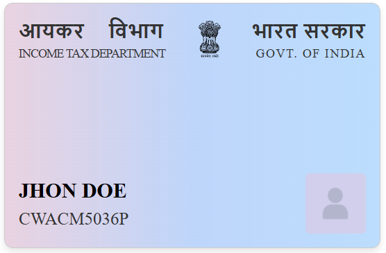

# Identity Card Component

This is a React component for displaying a PAN card and Aadhaar card.

## Installation

1. Install the component:

   ```bash
   npm install git+https://github.com/settle-finance/identity-card.git
   ```

## Usage For Pancard

1. Import the `PanCard` component in your project:

   ```jsx
   import { PanCard } from "identity-card";
   ```

2. Use the `PanCard` component in your application:

   ```jsx
   function App() {
     return (
       <div className="App">
         <PanCard name="John Doe" number="CWACM5036P" />
       </div>
     );
   }

   export default App;
   ```

### Example Output For Pan Card

Here's an example output of the PAN card component:



## Usage For Aadhaar Card

1. Import the `AadhaarCard` component in your project:

   ```jsx
   import { AadhaarCard } from "identity-card";
   ```

2. Use the `AadhaarCard` component in your application:

   ```jsx
   function App() {
     return (
       <div className="App">
         <AadhaarCard
           name="John Doe"
           dob="09/07/2000"
           gender="Male"
           address="205 B Wing Niwas House, MIDC Road"
           area="Andheri"
           district="Mumbai"
           state="Maharashtra"
           pincode="400072"
         />
       </div>
     );
   }

   export default App;
   ```

### Example Output For Aadhaar Card

Here's an example output of the Aadhaar card component:


