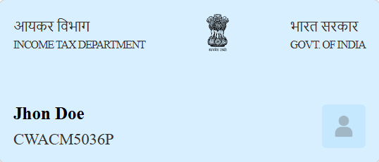

# PAN Card Component

This is a React component for displaying a PAN card with name and PAN number.

## Installation

1. Clone the repository:
    ```bash
    git clone https://github.com/settle-finance/identity-card.git
    ```

2. Navigate to the `pan-card-component` directory:
    ```bash
    cd identity-card/pan-card-component
    ```

3. Install the dependencies:
    ```bash
    npm install
    ```

## Usage

1. Import the `PanCard` component in your `App.jsx`:
    ```jsx
    import PanCard from "./PanCard";
    import "./PanCard.css"; // Ensure you import the CSS for styling
    ```

2. Use the `PanCard` component in your `App` component with sample data:
    ```jsx
    function App() {
      return (
        <div className="App">
          <PanCard name="Jhon Doe" panNumber="CWACM5036P" />
        </div>
      );
    }

    export default App;
    ```
## Running the Project
To run the project, follow these steps:

1. Start the Development Server:

    - Run the following command to start the development server:

        ```bash
        npm run dev
        ```
2. Open Your Browser:
    - Open your browser and navigate to provided localhost URL to see the PAN card component in action.

## Component Description

- **PanCard.jsx**: The main component file that renders the PAN card.
- **PanCard.css**: CSS file for styling the PAN card component.
- **assets**: Directory containing images used in the component.

### Example Output

Here's an example output of the PAN card component:

